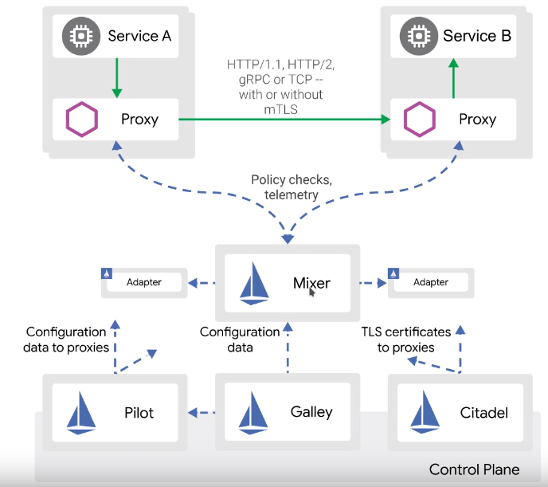

# kubernetes

## Creación de un cluster K8s
En el directorio `vagrant-provisioning` está lo necesario para provisionar un **master** y dos **workers**. Basta iniciar las instancias con ...
```
cd vagrant-provisioning
vagrant up
```
Esto creará tres máquinas viruales con un cluster K8s montado.

### Crear un usuario administrador
Crear el fichero `00-admin-user.yaml` con el siguiente contenido:
```
apiVersion: v1
kind: ServiceAccount
metadata:
  name: admin-user
  namespace: kube-system
---
apiVersion: rbac.authorization.k8s.io/v1
kind: ClusterRoleBinding
metadata:
  name: admin-user-rolebinding
roleRef:
  apiGroup: rbac.authorization.k8s.io
  kind: ClusterRole
  name: cluster-admin
subjects:
- kind: ServiceAccount
  name: admin-user
  namespace: kube-system
```
Para obtener el `token` ejecutar:
```
$ kubectl -n kube-system describe secret $(kubectl -n kube-system get secret | grep admin-user | awk '{print $1}')
```

### Configurar el acceso vía kubectl
#### Crear nuevas entradas en /etc/hosts
```
172.42.42.100 kmaster.example.com kmaster
172.42.42.101 kworker1.example.com kworker1
172.42.42.102 kworker2.example.com kworker2
```
#### Copiamos la configuración del master bajo ~/.kube
La password del usuario root es *kubeadmin*.
```
$ mkdir ~/.kube
$ scp root@kmaster.example.com:/etc/kubernetes/admin.conf ~/.kube
$ mv ~/.kube/admin.conf ~/.kube/config
$ kubectl cluster-info
Kubernetes master is running at https://172.42.42.100:6443
KubeDNS is running at https://172.42.42.100:6443/api/v1/namespaces/kube-system/services/kube-dns:dns/proxy

To further debug and diagnose cluster problems, use 'kubectl cluster-info dump'.
```
#### Verificación de los nodos
```
$ kubectl get nodes
NAME                   STATUS   ROLES    AGE   VERSION
kmaster.example.com    Ready    master   38m   v1.15.1
kworker1.example.com   Ready    <none>   36m   v1.15.1
kworker2.example.com   Ready    <none>   34m   v1.15.1
```
#### Instalación del Dashboard Web UI en K8s
Primero veamos los pods que hay en ejecución en el namespace `kube-system`
```
$ kubectl -n kube-system get pods -o wide
NAME                                          READY   STATUS    RESTARTS   AGE   IP              NODE                   NOMINATED NODE   READINESS GATES
coredns-5c98db65d4-9jw4f                      1/1     Running   0          46m   10.244.0.3      kmaster.example.com    <none>           <none>
coredns-5c98db65d4-cnknq                      1/1     Running   0          46m   10.244.0.2      kmaster.example.com    <none>           <none>
etcd-kmaster.example.com                      1/1     Running   0          45m   172.42.42.100   kmaster.example.com    <none>           <none>
kube-apiserver-kmaster.example.com            1/1     Running   0          45m   172.42.42.100   kmaster.example.com    <none>           <none>
kube-controller-manager-kmaster.example.com   1/1     Running   0          45m   172.42.42.100   kmaster.example.com    <none>           <none>
kube-flannel-ds-amd64-j2fg2                   1/1     Running   0          43m   172.42.42.102   kworker2.example.com   <none>           <none>
kube-flannel-ds-amd64-ld7c5                   1/1     Running   0          46m   172.42.42.100   kmaster.example.com    <none>           <none>
kube-flannel-ds-amd64-z72j7                   1/1     Running   0          45m   172.42.42.101   kworker1.example.com   <none>           <none>
kube-proxy-2cd9k                              1/1     Running   0          46m   172.42.42.100   kmaster.example.com    <none>           <none>
kube-proxy-bk7n9                              1/1     Running   0          45m   172.42.42.101   kworker1.example.com   <none>           <none>
kube-proxy-jwq6q                              1/1     Running   0          43m   172.42.42.102   kworker2.example.com   <none>           <none>
kube-scheduler-kmaster.example.com            1/1     Running   0          45m   172.42.42.100   kmaster.example.com    <none>           <none>
```

Ahora instalar el Dashboard. Ir al directorio `dashboard` y ejecutar:
```
$ cd dashboard
$ kubectl create -f influxdb.yaml
deployment.extensions/monitoring-influxdb created
service/monitoring-influxdb created
```
Si volvemos a consultar los pods del namespace `kube-system` veremos que hay nuevos pods en ejecución. Repetimos lo mismo con `heapster.yaml`
```
$ kubectl create -f heapster.yaml
erviceaccount/heapster created
clusterrolebinding.rbac.authorization.k8s.io/heapster-rolebinding created
deployment.extensions/heapster created
service/heapster created
```
Y lo mismo con `dashboard.yaml`
```
$ kubectl create -f dashboard.yaml
secret/kubernetes-dashboard-certs created
serviceaccount/kubernetes-dashboard created
role.rbac.authorization.k8s.io/kubernetes-dashboard-minimal created
rolebinding.rbac.authorization.k8s.io/kubernetes-dashboard-minimal created
deployment.apps/kubernetes-dashboard created
service/kubernetes-dashboard created
```
Si ahora hacemos de nuevo `kubectl -n kube-system get pods -o wide` veremos en qué máquina se ha instalado el dashboard. Podemos acceder a él con la siguiente URL: `https://kworker1.example.com:32323`. Ahora necesitamos crear una `service account` para acceder vía **token**. Para ello ejecutamos ...
```
$ kubectl create -f sa_cluster_admin.yaml
serviceaccount/dashboard-admin created
clusterrolebinding.rbac.authorization.k8s.io/cluster-admin-rolebinding created
```
Vamos a obtener el token creado. Para ello ...
```
$ # Obtenemos el ID secret del service account
$ kubectl describe sa dashboard-admin -n kube-system
Name:                dashboard-admin
Namespace:           kube-system
Labels:              <none>
Annotations:         <none>
Image pull secrets:  <none>
Mountable secrets:   dashboard-admin-token-xcbdj
Tokens:              dashboard-admin-token-xcbdj
Events:              <none>
$ # Obtenemos los detalles del secret
$ kubectl describe secret dashboard-admin-token-xcbdj -n kube-system
Name:         dashboard-admin-token-xcbdj
Namespace:    kube-system
Labels:       <none>
Annotations:  kubernetes.io/service-account.name: dashboard-admin
              kubernetes.io/service-account.uid: 72edfd43-949a-40c9-bcde-80c080ae8a85

Type:  kubernetes.io/service-account-token

Data
====
token:      eyJhbGci..._QXMvmjq3j7r-ovAQ
ca.crt:     1025 bytes
namespace:  11 bytes
```
Con el `token` obtenido, lo pegamos en la UI del Dashboard y ya tenemos acceso.

## Despliegue de un contenedor Docker en el cluster
Para desplegar un simple contenedor en el cluster, podemos hacer:
```
$ kubectl run myshell -it --image busybox -- sh
```
Para eliminaro:
```
$ kubectl delete deploy myshell
```

Arranquemos ahora un contenedor `nginx`
```
$ kubectl run nginx --image nginx
```
Ahora vamos a acceder al servicio nginx sin necesidad de crear un `service`. Esto lo hacemos con un `port-forward`.
```
$ kubectl port-forward nginx-7bb7cd8db5-ktpch 6789:80
```
Con esto podremos acceder a Nginx con http://localhost:6789. Para ver los **logs** del contenedor podemos ejecutar:
```
$ kubectl logs nginx-7bb7cd8db5-ktpch
```
Para aumentar el número de **réplicas**, es decir, el número de contenedores en ejecución, ejecutamos uno de los siguientes comandos:
```
$ kubectl run nginx --image nginx --replicas 2
$ kubectl scale deploy nginx --replicas 2
```
Vamos a crear un **servicio** (en lugar de hacer un port-forward). Para ello:
```
$ kubectl expose deployment nginx --type NodePort --port 80
```
Ahora vamos a generar un fichero yaml con la descripción de nginx, el puerto, el servicio, etc. Para ello:
```
$ kubectl get deploy nginx -o yaml > /tmp/nginx.yaml
$ kubectl get svc nginx -o yaml > /tmp/svc.yaml
```
Luego podemos aplicar esos recursos definidos en el yaml de la siguiente forma:
```
$ kubectl create -f /tmp/nginx.yaml
$ kubectl create -f /tmp/svc.yaml
```
Y para borrar recursos ...
```
$ kubectl delete -f /tmp/nginx.yaml
$ kubectl delete -f /tmp/svc.yaml
```
### Para monitorizar el estado
```
$ watch kubectl get all -o wide
```
## Creación de Pods, ReplicaSets and Deployments
### Creación de Pod
Un pod en K8s es la unidad más pequeña de ejecución. Por ejemplo, creamos el fichero `01-nginx-pod.yaml`, este será el contenido mínimo:
```
apiVersion: v1
kind: Pod
metadata:
  name: nginx
spec:
  containers:
  - image: nginx
    name: nginx
```
Se ejecutaría con `kubectl create -f 01-nginx-pod.yaml`. Y para elminarlo con `kubectl delete -f 01-nginx-pod.yaml`.
### Creación de ReplicaSet
Con esto indicaremos cuántos pods queremos en el cluster (también llamado `Replication Controller`). Cuidado con el `matchLables`, este ReplicaSet gestionará todos los pods que tengan el label `run` con el valor `nginx`. Creamos el fichero `01-nginx-replicaset.yaml`.
```
apiVersion: extensions/v1beta1
kind: ReplicaSet
metadata:
  name: nginx-replicaset # Nombre del ReplicaSet
spec:
  replicas: 2
  selector:
    matchLabels:
      run: nginx # Este ReplicaSet manejará todos los pods que
                 # cumplan este criterio
  template:
    metadata:
      labels:
        run: nginx # Esto debe coincidir con el matchLabels
                   # definido en el selector
    spec:
      containers:
      - image: nginx
        name: nginx
```
### Creación de un Deployment
La ventaja de usar Deployments sobre ReplicaSets es que cuando se despliega la aplicación, podemos elegir entre varias estrategias de despliegue. Cuando se crea un `Deployment`, automáticamente se crea también un `ReplicaSet`. Creamos el fichero `01-nginx-deployment.yaml` con el siguiente contenido. En principio es muy parecido al código del `ReplicaSet`.
```
apiVersion: extensions/v1beta1
kind: Deployment
metadata:
  name: nginx-deploy
spec:
  replicas: 2
  selector:
    matchLabels:
      run: nginx
  template:
    metadata:
      labels:
        run: nginx
    spec:
      containers:
      - image: nginx
        name: nginx
```
## Namespaces y Contexts
### Obtener una lista de los `namespaces` disponibles:
```
$ kubectl get namespaces
NAME              STATUS   AGE
default           Active   19h
kube-node-lease   Active   19h
kube-public       Active   19h
kube-system       Active   19h
```
### Creación de un ns
```
$ kubectl create ns tutorial
namespace/tutorial created
```
### Creación de un Context
Para obtener la configuración actual ejecutamos:
```
$ kubectl config view
apiVersion: v1
clusters:
- cluster:
    certificate-authority-data: DATA+OMITTED
    server: https://172.42.42.100:6443
  name: kubernetes
contexts:
- context:
    cluster: kubernetes
    user: kubernetes-admin
  name: kubernetes-admin@kubernetes
current-context: kubernetes-admin@kubernetes
kind: Config
preferences: {}
users:
- name: kubernetes-admin
  user:
    client-certificate-data: REDACTED
    client-key-data: REDACTED
```
Ahí podremos ver los **contextos** disponibles y el que está en ejecución. Pero para obtener los contextos disponibles es más fácil ejecutar:
```
$ kubectl config get-contexts
CURRENT   NAME                          CLUSTER      AUTHINFO           NAMESPACE
*         kubernetes-admin@kubernetes   kubernetes   kubernetes-admin
```
Para crear un nuevo `context` de nombre `tutorial-context`.
```
$ kubectl config set-context tutorial-context --namespace=tutorial --user=kubernetes-admin --cluster=kubernetes
Context "tutorial-context" created.
$ kubectl config get-contexts
CURRENT   NAME                          CLUSTER      AUTHINFO           NAMESPACE
*         kubernetes-admin@kubernetes   kubernetes   kubernetes-admin   
          tutorial-context              kubernetes   kubernetes-admin   tutorial
```
Cambiemos el contexto.
```
$ kubectl config use-context tutorial-context
Switched to context "tutorial-context".
```
A partir de ahora, todos los recursos que creemos, modifiquemos, borremos, ... se aplicarán al namespace `tutorial` (que es el namespace asociado al contexto).

## Node Selector
Esto servirá para que ciertos pods se ejecuten en **ciertos nodos** del cluster. Puede ser que queramos ejecutar un pod en cierto nodo porque tiene más memoria, más CPU, etc.

Para ello tendríamos que asociar `labels` a los nodos. Para ello:
```
$ kubectl label node kworker2.example.com demoserver=true
node/kworker2.example.com labeled
```
Para verificar que pusimos bien el `label`tendríamos que ejecutar:
```
$ kubectl get node kworker2.example.com --show-labels
NAME                   STATUS   ROLES    AGE   VERSION   LABELS
kworker2.example.com   Ready    <none>   22h   v1.15.1   ...,demoserver=true,...
```
Ahora veamos cómo modificar el `deployment` para hacer uso de ese `nodo` y ese `label`.
```
apiVersion: extensions/v1beta1
kind: Deployment
metadata:
  name: nginx-deploy
spec:
  replicas: 2
  selector:
    matchLabels:
      run: nginx
  template:
    metadata:
      labels:
        run: nginx
    spec:
      containers:
      - image: nginx
        name: nginx
      nodeSelector:             # Esta sería la nueva línea a incluir
        demoserver: "true"
```
## DaemonSets
Un DeamonSet es un pod que se despliega en todos los nodos del cluster. **Un pod por nodo**. Si se agrega un nuevo nodo al cluster, se desplegará el pod en ese nodo. Si un nodo muere, también desaparece ese pod (no se replanifica para ejecutarse en otro nodo).

Aunque pueden desplegarse estos `DaemonSets` en determinados nodos, por ejemplo, nodos con cierto `label`.

Creamos el fichero `01-nginx-daemonset.yaml` con el siguiente contenido:
```
apiVersion: extensions/v1beta1
kind: DaemonSet
metadata:
  name: nginx-daemonset
spec:
  selector:
    matchLabels:
      demotype: nginx-daemonset-demo
  template:
    metadata:
      labels:
        demotype: nginx-daemonset-demo
    spec:
      containers:
      - image: nginx
        name: nginx
```
Si queremos determinar en qué nodos debe ejecutarse este DaemonSet tendremos que incluir nuevas líneas
```
apiVersion: extensions/v1beta1
kind: DaemonSet
metadata:
  name: nginx-daemonset
spec:
  selector:
    matchLabels:
      demotype: nginx-daemonset-demo
  template:
    metadata:
      labels:
        demotype: nginx-daemonset-demo
    spec:
      containers:
      - image: nginx
        name: nginx
      nodeSelector:     # Aquí indicamos dónde ejecutarse el DaemonSet
        demoserver: "true"
```
## Jobs & CronJobs
### Jobs
Un job es algo que se ejecuta en el cluster. Por ejemplo, creamos el fichero `02-jobs.yaml` con el siguiente contenido.
```
apiVersion: batch/v1
kind: Job
metadata:
  name: helloworld
spec:
  completions: 2    # Número de veces que debe terminar el job
                    # Se ejecuta de forma secuencial
  template:
    spec:
      containers:
      - name: busybox
        image: busybox
        command: ["sleep", "60"]
      restartPolicy: Never
```
Si queremos ejecutar los jobs en paralelo tendríamos que incluir una nueva línea indicando el máximo número de jobs que podemos ejecutar en paralelo.
```
apiVersion: batch/v1
kind: Job
metadata:
  name: helloworld
spec:
  completions: 6
  parallelism: 2  # Se ejecutarán como máximo dos jobs en paralelo.
  template:
    spec:
      containers:
      - name: busybox
        image: busybox
        command: ["sleep", "60"]
      restartPolicy: Never
```
Es posible que la ejecución del job finalice con error, el job intentará crear un nuevo pod hasta que se alcance el nº de `completions` configurado en el job. Para eso tenemos el parámetro `backoffLimit`. Si se crean tantos pods como se indica en este parámetro y el job no finalizó con éxito, se cancela el job.
```
apiVersion: batch/v1
kind: Job
metadata:
  name: helloworld
spec:
  backoffLimit: 4   # Indicamos el máximo nº de intentos
  template:
    spec:
      containers:
      - name: busybox
        image: busybox
        command: ["ls", "/jcla"]    # Esto fallará
      restartPolicy: Never
```
Si queremos dar un tiempo límite para la ejecución del job, utilizaremos `activeDeadlineSeconds`.
```
apiVersion: batch/v1
kind: Job
metadata:
  name: helloworld
spec:
  activeDeadlineSeconds: 10 # Tiempo límite para ejecutar el job
  template:
    spec:
      containers:
      - name: busybox
        image: busybox
        command: ["sleep", "60"]   # Tardará más y fallará
      restartPolicy: Never
```
### CronJobs
Son iguales que los jobs pero que se ejecutan de forma periódica. Como ejemplo tenemos el fichero `02-cronjob.yaml`:
```
apiVersion: batch/v1beta1
kind: CronJob
metadata:
  name: helloworld-cron
spec:
  schedule: "* * * * *"
  jobTemplate:
    spec:
      template:
        spec:
          containers:
          - name: busybox
            image: busybox
            command: ["echo", "Hello Kubernetes!!!"]
          restartPolicy: Never
```
En este caso, cada minuto se creará un nuevo job que será el encargado de hacer el trabajo. Hay algunas propiedades y parámetros adicionales que no vamos a ver.

## Init containers
Se utilizan como contenedores auxiliares. Por ejemplo, un pod tendrá un `init container` para descargar el código fuente de Git, que quedará en un volumen compartido con el container principal que será el encargado de lanzar la aplicación con el código fuente descargado por el `init container`. Y hasta que la ejecución del `init container` no finaliza, no se iniciará el container principal.

Puede haber varios `init container` que se ejecutarán de forma secuencial. Creamos el fichero `03-init-container.yaml` con el siguiente contenido, lo que va a hacer será preparar el index.html en un volumen compartido para el pod principal.
```
apiVersion: extensions/v1beta1
kind: Deployment
metadata:
  labels:
    run: nginx
  name: nginx-deploy
spec:
  replicas: 1
  selector:
    matchLabels:
      run: nginx
  template:
    metadata:
      labels:
        run: nginx
    spec:
      volumes:
      - name: shared-volume
        emptyDir: {}
      initContainers:
      - name: busybox
        image: busybox
        volumeMounts:
        - name: shared-volume
          mountPath: /nginx-data
        command: ["/bin/sh"]
        args: ["-c", "echo '<h1>Hello Kubernetes</h1>' > /nginx-data/index.html"]
      containers:
      - image: nginx
        name: nginx
        volumeMounts:
        - name: shared-volume
          mountPath: /usr/share/nginx/html
```
Recordemos que para las pruebas podemos hacer:

1. `kubectl port-forward pod/nginx-deploy-6c6fd785f4-j2n2l 6789:80`
2. `kubectl expose deploy nginx-deployment --type NodePort --target-port 80`

## Secrets
Creamos el fichero `05-secrets.yaml` con el siguiente contenido:
```
apiVersion: v1
kind: Secret
metadata:
  name: secret-demo
type: Opaque
data:
  username: a3ViZXVzZXI=
  password: a3ViZXBhc3N3b3Jk
```
El username y password lo obtenemos así:
```
$ echo -n 'kubeuser' | base64
a3ViZXVzZXI=
```
```
echo -n 'kubepassword' | base64
a3ViZXBhc3N3b3Jk
```
Y creamos el recurso de tipo `Secret`. Veamos ahora cómo utilizar el `secret`. Tendremos dos formas:
1. Usar el `secret` como variable de entorno. El `secret` será montado como una variable de entorno.
2. Montar el `secret` como un volumen. Los `secrets` serán montados como ficheros individuales.

### Usar el `secret` como variable de entorno
Crear el fichero `05-pod-secret-env.yaml` con el siguiente contenido:
```
apiVersion: v1
kind: Pod
metadata:
  name: busybox
spec:
  containers:
  - image: busybox
    name: busybox
    command: ["/bin/sh"]
    args: ["-c", "sleep 600"]
    env:
    - name: myusername
      valueFrom:
        secretKeyRef:
          name: secret-demo
          key: username
```
Podemos acceder al pod y ver las variables de entorno de la siguiente forma:
```
$ kubectl exec -it busybox -- sh
```

### Montar el `secret` como un volumen
Creamos el fichero `05-pod-secret-volume.yaml` con el siguiente contenido:
```
apiVersion: v1
kind: Pod
metadata:
  name: busybox
spec:
  volumes:
  - name: secret-volume
    secret:
      secretName: secret-demo
  containers:
  - image: busybox
    name: busybox
    command: ["/bin/sh"]
    args: ["-c", "sleep 600"]
    volumeMounts:
    - name: secret-volume
      mountPath: /mydata
```
Accedemos al pod y podemos ejecutar:
```
# cd /mydata/
/mydata # ls -ltr
total 0
lrwxrwxrwx    1 root     root            15 Aug  1 14:03 username -> ..data/username
lrwxrwxrwx    1 root     root            15 Aug  1 14:03 password -> ..data/password
/mydata # cat username 
kubeuser
/mydata # cat password 
kubepassword
```
Se creará el volumen y en él habrá un fichero con el contenido de cada una de las variables que hemos definido en el `secret`.

## ConfigMaps
Se trata de externalizar la configuración de las imágenes.

Crear el fichero de nombre `06-configmap-1.yaml` con el siguiente contenido:
```
apiVersion: v1
kind: ConfigMap
metadata:
  name: demo-configmap
data:
  channel.name: "justmeandopensource"
  channel.owner: "Venkat Nagappan"
```

### Montar el ConfigMap como variables de entorno
Para usar esta configuración en un pod crear el fichero de nombre `06-pod-configmap-env.yaml` con el siguiente contenido:
```
apiVersion: v1
kind: Pod
metadata:
  name: busybox
spec:
  containers:
  - image: busybox
    name: busybox
    command: ["/bin/sh"]
    args: ["-c", "sleep 600"]
    env:
    - name: CHANNELNAME
      valueFrom:
        configMapKeyRef:
          name: demo-configmap
          key: channel.name
    - name: CHANNELOWNER
      valueFrom:
        configMapKeyRef:
          name: demo-configmap
          key: channel.owner
```
En este caso estamos presentando la configuración como variables de entorno.

### Montar el ConfigMap como volumen
Otra posibilidad es presentar la configuración en un volumen. Para ello crear el fichero de nombre `06-pod-configmap-volume.yaml` con el siguiente contenido:
```
apiVersion: v1
kind: Pod
metadata:
  name: busybox
spec:
  volumes:
  - name: demo
    configMap:
      name: demo-configmap
  containers:
  - image: busybox
    name: busybox
    command: ["/bin/sh"]
    args: ["-c", "sleep 600"]
    volumeMounts:
    - name: demo
      mountPath: /mydata
```
Los datos estarán disponibles en el directorio `/mydata`.

## Ejecución de Rolling Updates
Haremos un ejemplo con nginx con 4 réplicas y veremos cómo podemos actualizarlo. Creamos el fichero `08-nginx-rolling-update.yaml` con el siguiente contenido:
```
apiVersion: extensions/v1beta1
kind: Deployment
metadata:
  labels:
    run: nginx
  name: nginx-deploy
spec:
  replicas: 4
  selector:
    matchLabels:
      run: nginx
  strategy:
    type: RollingUpdate
    rollingUpdate:
      maxSurge: 0
      maxUnavailable: 1
  minReadySeconds: 5
  revisionHistoryLimit: 10
  template:
    metadata:
      labels:
        run: nginx
    spec:
      containers:
      - image: nginx:1.14
        name: nginx
```
Las líneas más importantes de este fichero son:
```
  strategy:
    type: RollingUpdate
    rollingUpdate:
      maxSurge: 0
      maxUnavailable: 1
  minReadySeconds: 5
  revisionHistoryLimit: 10
```
* **Strategy**. Puede ser 'RollingUpdate' o 'Recreate'. **RollingUpdate es básicamente para no tener corte de servicio**. Los pods se van actualizando poco a poco.
* **maxSurge**. Indica cuántos pods extra podrían crearse durante el RollingUpdate. En este caso tenemos 0 con lo que como mucho, habrá 4 pods simultáneos en ejecución, los 4 que indicamos en el ReplicaSet. También podemos indicar porcentajes.
* **maxUnavailable**. El máximo número de pods que puede haber sin servicio. También podemos indicar porcentajes.
* **minReadySeconds**. Una vez que el ReplicaSet crea un pod, el tiempo que debe esperar hasta crear otro pod. Esto no es ideal, lo bueno sería tener un Readiness Check y un Readiness Probe.
* **revisionHistoryLimit**. El número de versiones previas que guarda K8s.

Para actualizar el deployment, modificamos el yaml y cambiamos la imagen del contenedor. Cambiamos `- image: nginx:1.14` por `- image: nginx:1.14.2`. Y hacemos un `apply`.

Ahora podemos ejecutar:
```
$ kubectl rollout status deployment nginx-deploy
deployment "nginx-deploy" successfully rolled out
$ kubectl rollout history deployment nginx-deploy
deployment.extensions/nginx-deploy 
REVISION  CHANGE-CAUSE
2         <none>
3         <none>
```

Ahora veamos cómo actualizar la imagen desde línea de comando. Se trataría de ejecutar el siguiente comando:
```
kubectl set image deployment nginx-deploy nginx=nginx:1.15
```
Con esto actualizaremos la imagen a la nueva versión de modo progresivo.

### Detener el despliegue
Es posible pausar y reanudar el despliegue. Para ello, una vez iniciado un despliegue podemos ejecutar:
```
$ kubectl rollout pause deployment nginx-deploy
```
Si ahora consultamos el estado del rollout veremos:
```
$ kubectl rollout status deployment nginx-deploy
Waiting for deployment "nginx-deploy" rollout to finish: 1 out of 4 new replicas have been updated...
```

### Reanudar el despliegue
```
$ kubectl rollout resume deployment nginx-deploy
deployment.extensions/nginx-deploy resumed
$ kubectl rollout status deployment nginx-deploy
Waiting for deployment "nginx-deploy" rollout to finish: 2 out of 4 new replicas have been updated...
Waiting for deployment "nginx-deploy" rollout to finish: 3 out of 4 new replicas have been updated...
Waiting for deployment "nginx-deploy" rollout to finish: 3 of 4 updated replicas are available...
Waiting for deployment "nginx-deploy" rollout to finish: 3 of 4 updated replicas are available...
deployment "nginx-deploy" successfully rolled out
```

## Persistent Volumes & Persistent Volumes Claims
1. El primer paso es crear un `pv`.
2. El segundo, crear un `pvc`.
3. El tercero, crear un pod que usa el `pvc`.

**Una vez que el `pvc` se asocia a un `pv`, nadie más podrá utilizar el `pv`.**

Los `pv` pueden ser estáticos (un determinado tamaño, fijos) o pueden ser dinámicos, es lo que se denominan `Storage Class`. Ejemplo, EBS de AWS (elastic block store).

Ciclo de vida de un `pv`. Se denomina `ReclaimPolicy` y puede ser:
1. `Retain`. Una vez que un deployment que hace uso de un `pv` es borrado, los datos seguirán en el `pv`, no se borrarán. Es la que viene por defecto.
2. `Recycle`. Deprecada y para `pv` dinámicos.
3. `Delete`. Cuando se borra el deployment que hace uso del `pv` también se borrarán los datos asociados.

Modos de acceso o `Access Mode`:
1. `RWO`: Sólo un nodo será capaz de escribir. Todos podrán leer.
2. `RWM`: Todos los nodos serán capaces de leer y escribir.
3. `RO`: Sólo permiso de lectura.

Vamos a hacer un ejemplo con el tipo de **Persistent Volume = HostPath** (Single node testing only - local storage is not supported in any way and WILL NOT WORK in a multi-node cluster).
* Creamos el pv
* Creamos el pvc
* Creamos el deployment que hará uso del pvc

Creamos el fichero de nombre `04-pv-hostpath.yaml` con el siguiente contenido:
```
apiVersion: v1
kind: PersistentVolume
metadata:
  name: pv-hostpath
spec:
  storageClassName: manual
  capacity:
    storage: 1Gi
  accessModes:
    - ReadWriteOnce
  hostPath:             # Aquí indico el tipo de pv que voy a crear
    path: "/kube"
```
Antes de lanzarlo, entramos en `kworker1` con root y creamos el directorio `/kube` con permisos 777. Luego lanzamos el `pv`, estará creado pero no estará asociado a ningún nodo todavía.
```
$ kubectl get pv
NAME          CAPACITY   ACCESS MODES   RECLAIM POLICY   STATUS      CLAIM   STORAGECLASS   REASON   AGE
pv-hostpath   1Gi        RWO            Retain           Available           manual                  86s
```
Ahora vamos a crear el `pvc`. Para ello creamos el fichero de nombre `04-pvc-hostpath.yaml` con el siguiente contenido:
```
apiVersion: v1
kind: PersistentVolumeClaim
metadata:
  name: pvc-hostpath
spec:
  storageClassName: manual
  accessModes:
    - ReadWriteOnce
  resources:
    requests:
      storage: 100Mi
```
Lo único que nos queda es lanzar un pod que haga uso de este `pvc`. Creamos un fichero de nombre `04-busybox-pv-hostpath.yaml` con el siguiente contenido:
```
apiVersion: v1
kind: Pod
metadata:
  name: busybox
spec:
  volumes:
  - name: host-volume
    persistentVolumeClaim:
      claimName: pvc-hostpath
  containers:
  - image: busybox
    name: busybox
    command: ["/bin/sh"]
    args: ["-c", "sleep 600"]
    volumeMounts:
    - name: host-volume
      mountPath: /mydata
```

# Ingress controller
En AWS, GCP o Azure, cuando creas un `service` del tipo Load Balancer, el provider automáticamente crea un punto de acceso a tus servicios. Pero en `bare metal` tenemos que preocuparnos del `Load Balancing`. Aquí es donde entra el juego el `ingress`.

Necesitamos por un lado el `ingress controller` y por otro lado el `ingress resource`. El primero podemos desplegarlo tanto como DaemonSet como Deployment. En el segundo crearemos un conjunto de reglas para direccionar el tráfico. Por ejemplo, cuando la petición venga de esta dirección, enrútala a este servicio. Cuando se configuran esas reglas, cada `ingress controller` tomará nota de esas reglas y sabrá qué hacer.

Necesitamos también un balanceador en el que registraremos todos los `workers nodes`. En este caso usaremos **HA proxy**. Configuraremos un **HA proxy** y un DNS para que todas las peticiones que hagamos vayan a este balanceador de carga que luego distribuirá las peticiones a los distitos worker nodes que tengamos. Y finalmente, el `ingress controller` sabrá cómo enrutar el tráfico (es decir, a qué servicio) dependiendo de dónde venga la petición.

## Qué necesitamos para desplegar un Ingress Controller?
Necesitamos los siguientes recursos K8s:

* Namespace
* Service Account
* Cluster Role
* Cluster Role Binding
* Config Map
* Secret
* DaemonSet

Y hay varios `ingress controller` que podemos utilizar como:

* Nginx
* Nginx +
* Traefik

En este ejemplo usaremos Nginx.

## Creación del HA Proxy
Primero instalamos HA Proxy
```
$ sudo apt install haproxy
```
Luego lo configuramos modificando el fichero `/etc/haproxy/haproxy.cfg` e incluyendo el siguiente contenido (dejamos el *global settings* y el *default*):
```
frontend http_front
  bind *:80
  stats uri /haproxy?stats
  default_backend http_back

backend http_back
  balance roundrobin
  server kube 172.42.42.101:80
  server kube 172.42.42.102:80
```
Ahora habilitamos el HA proxy.
```
$ sudo systemctl enable haproxy.service
$ sudo systemctl status haproxy.service
$ sudo systemctl start haproxy.service
$ sudo systemctl stop haproxy.service
```

## Creación de los recursos necesarios en K8s
Las instrucciones están aquí: https://github.com/nginxinc/kubernetes-ingress/blob/master/docs/installation.md

Ahora clonamos el siguiente repositorio git:
```
$ cd /tmp
$ git clone git@github.com:nginxinc/kubernetes-ingress.git
$ cd kubernetes-ingress/deployments/
# Creamos el namespace y el service account.
$ kubectl apply -f common/ns-and-sa.yaml
# Se creará un nuevo namespace de nombre nginx-ingress
# Todos los recursos que creemos se desplegarán en ese namespace: nginx-ingress
```

El siguiente paso es crear un secret con el certificado del servidor Nginx.
```
$ kubectl apply -f common/default-server-secret.yaml
```
El siguiente crear un config.
```
$ kubectl apply -f common/nginx-config.yaml
```
El siguiente crear un RBAC.
```
$ kubectl apply -f rbac/rbac.yaml
```
El siguiente crear un DaemonSet. De esta forma todos los kworkers tendrán un ingress controller.
```
$ kubectl apply -f daemon-set/nginx-ingress.yaml
```
Con esto hemos creado el **ingress controller** en los worker nodes.

## Creación de deployment y de service para probar el ingress controller
Lanzamos el siguiente deployment que lanzará un contenedor Nginx.
```
apiVersion: extensions/v1beta1
kind: Deployment
metadata:
  labels:
    run: nginx
  name: nginx-deploy-main
spec:
  replicas: 1
  selector:
    matchLabels:
      run: nginx-main
  template:
    metadata:
      labels:
        run: nginx-main
    spec:
      containers:
      - image: nginx
        name: nginx
```
Creamos un yaml y lo ejecutamos con
```
$ kubectl create -f fich.yaml
```
Ya tenemos los pods, ahora necesitamos crear un `service` del tipo `ClusterIP`. Si no especificamos el tipo, por defecto se creará un `Cluster IP`.
```
$ kubectl expose deploy nginx-deploy-main --port 80
```

## Creación del Ingress Resource
```
apiVersion: extensions/v1beta1
kind: Ingress
metadata:
  name: ingress-resource-1
spec:
  rules:
  - host: nginx.example.com
    http:
      paths:
      - backend:
          serviceName: nginx-deploy-main
          servicePort: 80
```

## Creación de entrada DNS para HA Proxy
Creamos una entrada en /etc/hosts para `nginx.example.com`. En mi caso tengo HA Proxy corriendo en local, por tanto ...
```
127.0.0.1   nginx.example.com
```

## Creación de nuevo Deployment para nuevo ejemplo de ingress controller
Creamos el siguiente deployment:
```
apiVersion: extensions/v1beta1
kind: Deployment
metadata:
  labels:
    run: nginx
  name: nginx-deploy-blue
spec:
  replicas: 1
  selector:
    matchLabels:
      run: nginx-blue
  template:
    metadata:
      labels:
        run: nginx-blue
    spec:
      volumes:
      - name: webdata
        emptyDir: {}
      initContainers:
      - name: web-content
        image: busybox
        volumeMounts:
        - name: webdata
          mountPath: "/webdata"
        command: ["/bin/sh", "-c", 'echo "<h1>I am <font color=blue>BLUE</font></h1>" > /webdata/index.html']
      containers:
      - image: nginx
        name: nginx
        volumeMounts:
        - name: webdata
          mountPath: "/usr/share/nginx/html"
```
Esto creará in container con una página html en color azul. Lo mismo con el siguiente deployment que creará una página en color verde.
```
apiVersion: extensions/v1beta1
kind: Deployment
metadata:
  labels:
    run: nginx
  name: nginx-deploy-green
spec:
  replicas: 1
  selector:
    matchLabels:
      run: nginx-green
  template:
    metadata:
      labels:
        run: nginx-green
    spec:
      volumes:
      - name: webdata
        emptyDir: {}
      initContainers:
      - name: web-content
        image: busybox
        volumeMounts:
        - name: webdata
          mountPath: "/webdata"
        command: ["/bin/sh", "-c", 'echo "<h1>I am <font color=green>GREEN</font></h1>" > /webdata/index.html']
      containers:
      - image: nginx
        name: nginx
        volumeMounts:
        - name: webdata
          mountPath: "/usr/share/nginx/html"
```

Ahora creamos un servicio para los nuevos deployments que hemos creado
```
$ kubectl expose deploy nginx-deploy-blue --port 80
$ kubectl expose deploy nginx-deploy-green --port 80
```

Con esto tendremos tres servicios. Ahora tenemos que definir un `ingress resource`. Antes de crear este eliminamos el otro que habíamos creado con:
```
$ kubectl delete ingress ingress-resource-1
```

```
apiVersion: extensions/v1beta1
kind: Ingress
metadata:
  name: ingress-resource-2
spec:
  rules:
  - host: nginx.example.com
    http:
      paths:
      - backend:
          serviceName: nginx-deploy-main
          servicePort: 80
  - host: blue.nginx.example.com
    http:
      paths:
      - backend:
          serviceName: nginx-deploy-blue
          servicePort: 80
  - host: green.nginx.example.com
    http:
      paths:
      - backend:
          serviceName: nginx-deploy-green
          servicePort: 80
```
Ahora solo falta crear las entradas correspondientes en /etc/hosts para los servidores blue y green.
```
127.0.0.1       nginx.example.com
127.0.0.1       blue.nginx.example.com
127.0.0.1       green.nginx.example.com
```

# Instalación de Istio

Istio se instala como sidecar junto a cada `service` que tengamos. Todas las peticiones que reciban nuestros `services` serán enviadas por el sidecar de istio, por tanto se sitúa como un frontend delante de nuestros `services`.

## Arquitectura



### Proxy
Se instala como sidecar junto a cada servicio.

### Mixer
Colecta métricas del proxy.

### Pilot
Es el que envía las configuraciones a los proxies. Cuando se definen las reglas/policies.

### Galley
Valida las configuraciones.

### Citadel
Se encarga de securizar las conexiones (TSL, ...)

## Instalación

Se necesita instalar `Helm` y `MetalLB`.

### Helm

#### Instalación de Helm
Tenemos que crear el componente `Tiller` y darle permisos suficientes para que pueda desplegar recursos en los nodos. Crearemos una service account de nombre `tiller` y crearemos un ClusterRoleBinding del tipo cluster-admin.
```
$ sudo snap install helm --classic
$ kubectl create serviceaccount tiller -n kube-system
$ kubectl create clusterrolebinding tiller --clusterrole cluster-admin --serviceaccount=kube-system:tiller
```
Hay un problema con las últimas versiones de helm y tiller. Antes se podía hacer lo siguiente ... `helm init --service-account tiller`. Y tenemos que hacerlo de todas formas para crear los directorios locales en ~/.helm. Pero ahora es necesario hacer lo siguiente
```
$ cd /tmp
$ helm init --service-account tiller --output yaml > tiller.yaml
```
Ahora hay que editar el fichero tiller.yaml y cambiar el apiVersion por `apiVersion: apps/v1` e incluir el selector siguiente
```
spec:
  replicas: 1
  strategy: {}
  selector:
    matchLabels:
      app: helm
      name: tiller
```
Luego aplicar el tiller.yaml
```
$ kubectl create -f tiller.yaml
```
El último comando instalará `tiller` en el namespace `kube-system`.

En caso de duda, echar un vistazo a la página https://github.com/helm/helm/issues/6374

### MetalLB

#### Instalación de MetalLB
Si creamos un `service` de tipo LoadBalancer en un cluster local, no funcionará. El campo External-IP se quedará siempre en estado *pending*. Las instrucciones de instalación están aquí: https://metallb.universe.tf/installation/
```
$ kubectl apply -f https://raw.githubusercontent.com/google/metallb/v0.8.1/manifests/metallb.yaml
namespace/metallb-system created
podsecuritypolicy.policy/speaker created
serviceaccount/controller created
serviceaccount/speaker created
clusterrole.rbac.authorization.k8s.io/metallb-system:controller created
clusterrole.rbac.authorization.k8s.io/metallb-system:speaker created
role.rbac.authorization.k8s.io/config-watcher created
clusterrolebinding.rbac.authorization.k8s.io/metallb-system:controller created
clusterrolebinding.rbac.authorization.k8s.io/metallb-system:speaker created
rolebinding.rbac.authorization.k8s.io/config-watcher created
daemonset.apps/speaker created
deployment.apps/controller created
```
Desplegará varios recursos en el namespace `metallb-system`. Entre otros el **controller** y el **speaker**.

* controller. Se encargará de la asignación de direcciones IP para el LoadBalancer.
* speaker. Se encarga de asegurar que se puede acceder al servicio a través de la IP del LoadBalancer.

Vemos que el **controller** se despliega como *deployment* y el **speaker** como *DaemonSet*.

#### Configuración de MetalLB
La configuración está documentada aquí: https://metallb.universe.tf/configuration/. La más sencilla es la `Layer 2 Configuration`. Se trata de crear un ConfigMap.
```
apiVersion: v1
kind: ConfigMap
metadata:
  namespace: metallb-system
  name: config
data:
  config: |
    address-pools:
    - name: default
      protocol: layer2
      addresses:
      - 172.42.42.220-172.42.42.250
```
En el campo `addresses` tenemos que indicar un rango de IPs del cluster.
```
$ kubectl get nodes -o wide
NAME                   STATUS   ROLES    AGE     VERSION   INTERNAL-IP
kmaster.example.com    Ready    master   5d19h   v1.15.3   172.42.42.100
kworker1.example.com   Ready    <none>   5d18h   v1.15.3   172.42.42.101
kworker2.example.com   Ready    <none>   5d18h   v1.15.3   172.42.42.102
```

#### Comprobación
Desplegamos la aplicación tutorial.
```
$ kubectl run tutorial --image=lyhsoft/tutorial:1
```
Y ahora exponemos el servicio con el tipo `LoadBalancer`
```
$ kubectl expose deploy tutorial --port 80 --target-port 1234 --type LoadBalancer
service/tutorial exposed
```

### Istio
Descargamos el software:
```
$ cd /opt
$ curl -L https://git.io/getLatestIstio | ISTIO_VERSION=1.3.0 sh -
```
Llevamos el programa `istioctl` al directorio `/usr/local/bin`.
```
$ cd /opt/istio-1.3.0
$ sudo mv bin/istioctl /usr/local/bin/
```
Utilizaremos una aplicación que viene de ejemplo que se llama **bookinfo** que está dentro de la carpeta 'samples'.

#### Verificamos la instalación
```
$ istioctl verify-install
Checking the cluster to make sure it is ready for Istio installation...

#1. Kubernetes-api
-----------------------
Can initialize the Kubernetes client.
Can query the Kubernetes API Server.

#2. Kubernetes-version
-----------------------
Istio is compatible with Kubernetes: v1.15.3.

#3. Istio-existence
-----------------------
Istio will be installed in the istio-system namespace.

#4. Kubernetes-setup
-----------------------
Can create necessary Kubernetes configurations: Namespace,ClusterRole,ClusterRoleBinding,CustomResourceDefinition,Role,ServiceAccount,Service,Deployments,ConfigMap. 

#5. Sidecar-Injector
-----------------------
This Kubernetes cluster supports automatic sidecar injection. To enable automatic sidecar injection see https://istio.io/docs/setup/kubernetes/additional-setup/sidecar-injection/#deploying-an-app

-----------------------
Install Pre-Check passed! The cluster is ready for Istio installation.
```

#### Instalación de Istio usando charts de Helm
```
$ cd /opt/istio-1.3.0
$ helm install install/kubernetes/helm/istio-init --name istio-init --namespace istio-system
```
Primero definimos variables de entorno para crear un secret (para la instalación de Kiali).
```
$ KIALI_USERNAME=$(read -p 'Kiali Username: ' uval && echo -n $uval | base64)
$ KIALI_PASSPHRASE=$(read -sp 'Kiali Passphrase: ' pval && echo -n $pval | base64)
$ NAMESPACE=istio-system
```
Y ejecutamos el siguiente comando.
```
$ cat <<EOF | kubectl apply -f -
apiVersion: v1
kind: Secret
metadata:
  name: kiali
  namespace: $NAMESPACE
  labels:
    app: kiali
type: Opaque
data:
  username: $KIALI_USERNAME
  passphrase: $KIALI_PASSPHRASE
EOF
```
Podemos verificar que se ha creado correctamente con ...
```
$ kubectl describe secret kiali -n istio-system
Name:         kiali
Namespace:    istio-system
Labels:       app=kiali
Annotations:  
Type:         Opaque

Data
====
passphrase:  8 bytes
username:    5 bytes
```
Ahora instalamos Istio.
```
$ helm install install/kubernetes/helm/istio --name istio --namespace istio-system --set kiali.dashboard.grafanaURL=http://grafana:3000 --set grafana.enabled=True --set kiali.enabled=True
...
Your release is named Istio.

To get started running application with Istio, execute the following steps:
1. Label namespace that application object will be deployed to by the following command (take default namespace as an example)

$ kubectl label namespace default istio-injection=enabled
$ kubectl get namespace -L istio-injection

2. Deploy your applications

$ kubectl apply -f <your-application>.yaml

For more information on running Istio, visit:
https://istio.io/
```

#### Desinstalación
```
$ helm delete --purge istio
$ helm delete --purge istio-init
```

### Aplicación de ejemplo
https://istio.io/docs/examples/bookinfo/

Para que Istio pueda inyectar los sidecars a los pods, tenemos que etiquetar el namespace en el que están corriendo con `istio-injection=enabled`.

Creamos un nuevo namespace y lo etiquetamos de la siguiente forma:
```
$ kubectl create ns ns-book-info-dev
$ kubectl label namespace ns-book-info-dev istio-injection=enabled
$ kubectl describe ns ns-book-info-dev
Name:         ns-book-info-dev
Labels:       istio-injection=enabled
Annotations:  <none>
Status:       Active

No resource quota.

No resource limits.
```
Ahora creamos la aplicación:
```
$ kubectl create -f /opt/istio-1.3.0/samples/bookinfo/platform/kube/bookinfo.yaml -n ns-book-info-dev
```
Verificamos que accedemos a ella desde cualquier pod.
```
$ kubectl exec -it $(kubectl get pod -n ns-book-info-dev -l app=ratings -o jsonpath='{.items[0].metadata.name}') -n ns-book-info-dev -c ratings -- curl productpage:9080/productpage | grep -o "<title>.*</title>"
<title>Simple Bookstore App</title>
```
Y la hacemos accesible desde el exterior. Pero ya sabemos cómo acceder porque tenemos creado un ingress de tipo LoadBalancer para Istio.
```
$ kubectl get svc -n istio-system | grep LoadBalancer
istio-ingressgateway     LoadBalancer   10.96.166.143    172.42.42.220
```
La IP externa es 172.42.42.220 (la obtenemos por tener MetalLB instalado en nuestro cluster). Ahora, para acceder a mi aplicación necesito crear un `Gateway`.
```
apiVersion: networking.istio.io/v1alpha3
kind: Gateway
metadata:
  name: bookinfo-gateway
spec:
  selector:
    istio: ingressgateway # use istio default controller
  servers:
  - port:
      number: 80
      name: http
      protocol: HTTP
    hosts:
    - "*"
---
apiVersion: networking.istio.io/v1alpha3
kind: VirtualService
metadata:
  name: bookinfo
spec:
  hosts:
  - "*"
  gateways:
  - bookinfo-gateway
  http:
  - match:
    - uri:
        exact: /productpage
    - uri:
        prefix: /static
    - uri:
        exact: /login
    - uri:
        exact: /logout
    - uri:
        prefix: /api/v1/products
    route:
    - destination:
        host: productpage
        port:
          number: 9080
```
Ejecutamos el siguiente comando para crear este Gateway.
```
$ kubectl create -f /opt/istio-1.3.0/samples/bookinfo/networking/bookinfo-gateway.yaml -n ns-book-info-dev
```
Comprobamos los recursos creados con
```
$ kubectl get gateway -o wide -n ns-book-info-dev
NAME               AGE
bookinfo-gateway   95s
$ kubectl get virtualservice -o wide -n ns-book-info-dev
NAME       GATEWAYS             HOSTS   AGE
bookinfo   [bookinfo-gateway]   [*]     113s
```
La app está accesible en la siguiente URL (utilizamos la external-ip).

http://172.42.42.220/productpage

### Kiali

#### Variables de entorno

Definimos variables de entorno para crear un secret.
```
$ KIALI_USERNAME=$(read -p 'Kiali Username: ' uval && echo -n $uval | base64)
$ KIALI_PASSPHRASE=$(read -sp 'Kiali Passphrase: ' pval && echo -n $pval | base64)
$ NAMESPACE=istio-system
```
Y ejecutamos el siguiente comando.
```
$ cat <<EOF | kubectl apply -f -
apiVersion: v1
kind: Secret
metadata:
  name: kiali
  namespace: $NAMESPACE
  labels:
    app: kiali
type: Opaque
data:
  username: $KIALI_USERNAME
  passphrase: $KIALI_PASSPHRASE
EOF
```
Podemos verificar que se ha creado correctamente con ...
```
$ kubectl describe secret kiali -n istio-system
Name:         kiali
Namespace:    istio-system
Labels:       app=kiali
Annotations:  
Type:         Opaque

Data
====
passphrase:  8 bytes
username:    5 bytes
```

#### Reinstalación de Istio con el add-on de Kiali y Grafana habilitados
```
$ cd /opt/istio-1.3.0
$ helm install install/kubernetes/helm/istio --name istio --namespace istio-system --set grafana.enabled=True --set kiali.enabled=True
```

#### Reinstalación de la aplicación book-info
```
$ kubectl create -f /opt/istio-1.3.0/samples/bookinfo/platform/kube/bookinfo.yaml -n ns-book-info-dev
# Este segundo yaml no se ejecutó en la primera instalación
$ kubectl create -f /opt/istio-1.3.0/samples/bookinfo/networking/destination-rule-all.yaml -n ns-book-info-dev
```

#### Acceso a Kiali
Antes vamos a generar algo de tráfico. Se enviará una petición cada 2 segundos.
```
$ watch curl -s -o /dev/null http://172.42.42.220/productpage
```
Vemos que Kiali sólo es accesible desde dentro del cluster
```
$ kubectl get svc kiali -n istio-system
NAME    TYPE        CLUSTER-IP      EXTERNAL-IP   PORT(S)     AGE
kiali   ClusterIP   10.110.201.92   <none>        20001/TCP   16m
```

Tenemos dos opciones: O editamos el servicio y cambiamos el tipo de ClusterIP a NodePort con la orden
```
$ kubectl edit svc kiali -n istio-system
```
o bien hacemos un port-forwarding de la siguiente forma
```
$ kubectl port-forward kiali-pod-52233566 20001:20001 -n istio-system
```

#### Istio Request Routing
